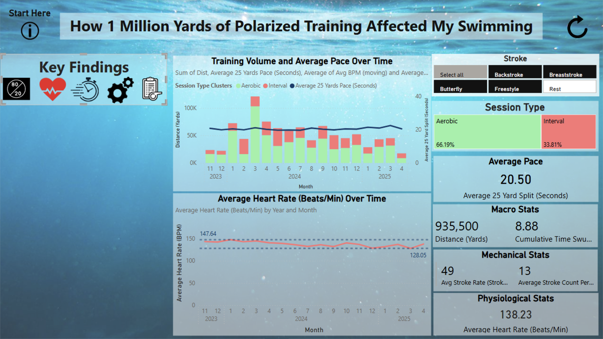

# How 1 Million Yards of Polarized Training Affected My Swimming

Welcome to my Power BI report exploring polarized training in swimming—an approach that helped me return from shoulder injury in 2023 and rethink how I train after 25 years in the pool. I’m a competitive Masters swimmer and former Johns Hopkins athlete, with experience racing the 200-meter butterfly at a national level. This project visualizes a year’s worth of heart rate, stroke rate, and split time data from over 200 swim sessions to understand if “slower” training can lead to faster, more efficient racing.

Polarized training emphasizes doing 80% of sessions at low intensity and 20% at very high intensity. This strategy—popularized by Dr. Stephen Seiler—aims to grow both aerobic endurance and top-end speed by minimizing the fatigue, stress, and strain that builds from always training at high effort. While controversial in traditional swim circles (where "garbage yardage" is often dismissed), I wanted to test whether this method made me faster or more efficient by tracking metrics like heart rate vs. pace, energy system use, and technique variables like distance per stroke.

This dashboard helps me answer key questions: Does my average heart rate drop when pace is held constant? Am I swimming faster for the same heart rate? Are certain stroke mechanics more efficient? Explore the report by clicking through the “Key Findings” icons on the left, and use filters to dive into specific strokes, timeframes, or variables. All data was captured via FORM Smart Goggles and a Polar OH1 heart-rate monitor—over 1 million yards of swimming aggregated to reveal trends, breakthroughs, and training insights.

[You can access the report here.](https://app.powerbi.com/view?r=eyJrIjoiMjAyMDI2ZDYtZGY1OS00MjI3LTlkYTYtMWUzZjk0NzkwMGVmIiwidCI6ImJjMzM5NDJjLTE2YjQtNDcwYS04Yjc5LTk1MmNmMzY0NmJjYiIsImMiOjZ9)
